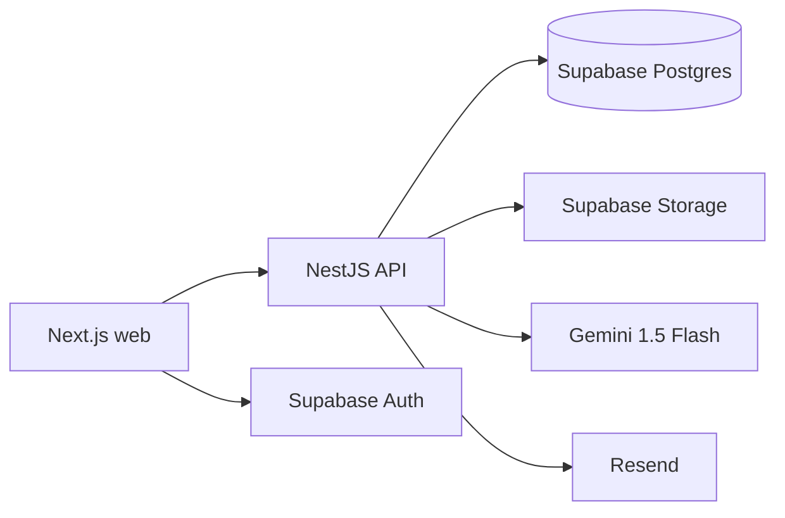
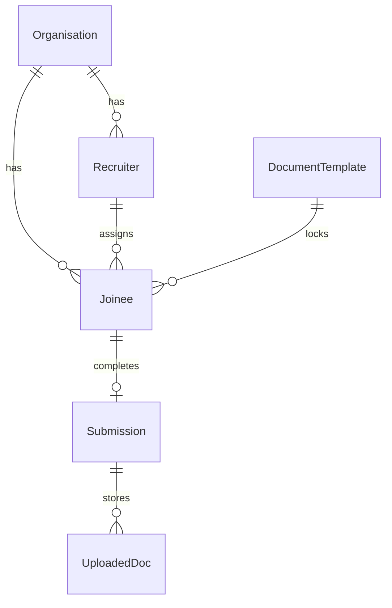
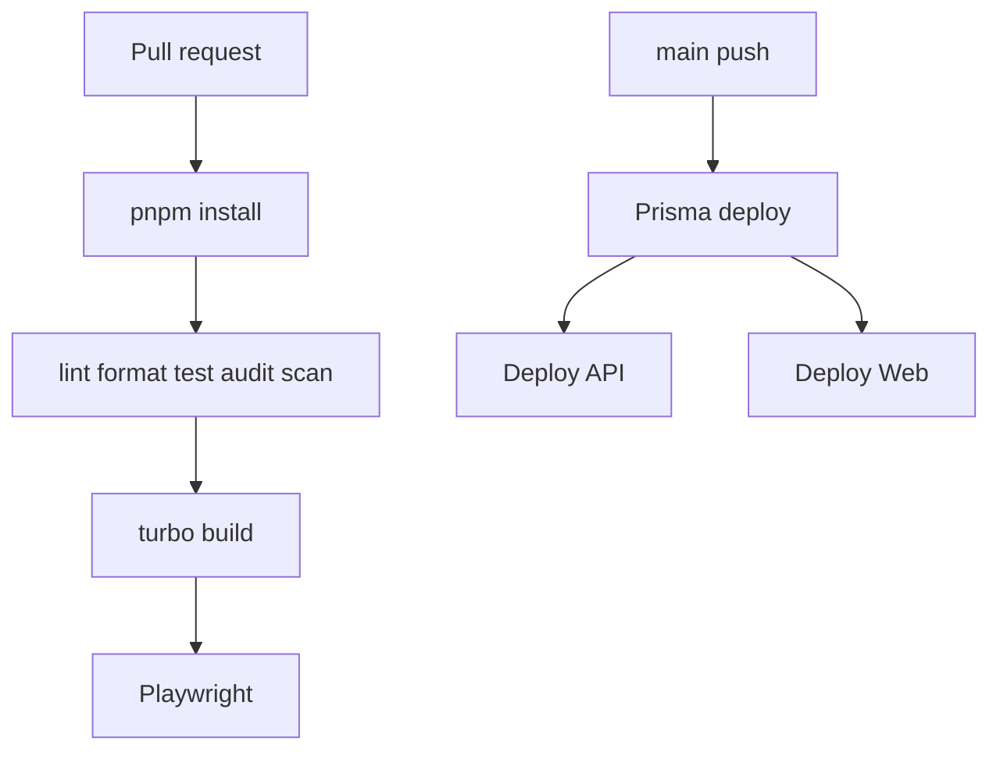

# FirstDay

[CI badge] [Deploy badge] [Coverage badge] [License badge]

> Production-shaped recruiter and joinee onboarding workspace with document workflows, AI extraction, PDF signing, and auditability.

## Features

- Supabase Auth-backed recruiter login and custom joinee access flow.
- Recruiter dashboard for templates, joinee assignment, status tracking, and submission preview.
- Joinee wizard for uploads, AI-assisted fields, signature consent, and PDF download.
- NestJS API with throttling, Helmet, CSRF guard, audit logging, signed storage URLs, Gemini extraction, and Resend email hooks.

## Architecture diagram



## Tech stack table

| Layer    | Stack                                                              |
| -------- | ------------------------------------------------------------------ |
| Monorepo | Turborepo, pnpm workspaces                                         |
| Web      | Next.js 14, Tailwind, SCSS modules, Zustand, Jotai, TanStack Query |
| API      | NestJS 10, Fastify, Prisma, Passport, Swagger                      |
| Data     | Supabase Postgres, Supabase Storage                                |
| Quality  | Vitest, Playwright, ESLint, Prettier, TruffleHog, Snyk             |

## Monorepo structure

```text
apps/web
apps/api
packages/schemas
packages/types
packages/ui
packages/config
```

## Prerequisites

- Node.js 20
- pnpm 9
- Supabase project with Auth, Postgres, and Storage
- Gemini and Resend API keys

## Local setup

```bash
pnpm install
cp .env.example .env
pnpm --filter @onboarding/api prisma:generate
pnpm --filter @onboarding/api prisma:migrate:deploy
pnpm dev
```

## Environment variables

| Name                            | Description                           |
| ------------------------------- | ------------------------------------- |
| `DATABASE_URL`                  | Supabase Postgres connection string   |
| `SUPABASE_URL`                  | Supabase project URL                  |
| `SUPABASE_SERVICE_ROLE_KEY`     | Server-side Supabase service role key |
| `SUPABASE_JWT_SECRET`           | Supabase JWT verification secret      |
| `JOINEE_JWT_SECRET`             | Secret for joinee-scoped API tokens   |
| `GEMINI_API_KEY`                | Gemini extraction API key             |
| `RESEND_API_KEY`                | Resend email API key                  |
| `WEB_ORIGIN`                    | Allowed web origin for API CORS       |
| `NEXT_PUBLIC_API_URL`           | Browser-facing API URL                |
| `NEXT_PUBLIC_SUPABASE_URL`      | Browser-facing Supabase URL           |
| `NEXT_PUBLIC_SUPABASE_ANON_KEY` | Supabase anon key                     |

## npm scripts reference

- `pnpm dev`: run all dev servers.
- `pnpm build`: build all apps and packages.
- `pnpm lint`: lint all packages.
- `pnpm test`: run unit and component tests.
- `pnpm --filter @onboarding/web e2e`: run Playwright tests.

## API documentation

Swagger is available at `/docs` on the API server.

## Database schema diagram



## CI/CD pipeline



## Security notes

- Helmet, throttling, CSRF protection, server-side MIME validation, signed URLs, audit logging, dependency audit, and secret scanning are part of v1.
- Dev-only helpers must remain guarded by `NODE_ENV === "development"`.

## Contributing guide

- Branch naming: `feat/`, `fix/`, `chore/`, `docs/`
- Commit convention: Conventional Commits
- PR checklist: tests pass, no secrets, schemas updated before consumers, migrations reviewed.

## Roadmap

- [ ] Bulk joinee import
- [ ] Aadhaar eSign via DigiLocker
- [ ] Multi-language support
- [ ] Mobile app (React Native, shared schemas)

## License

Proprietary unless a license file is added.
