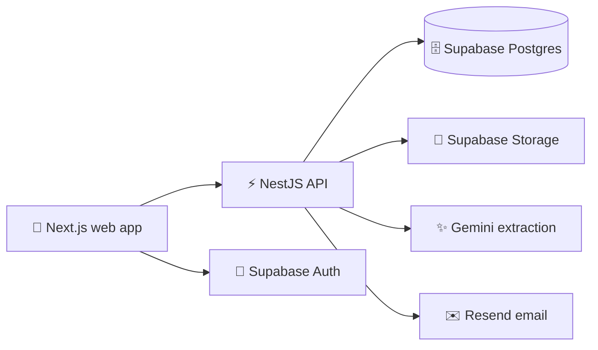
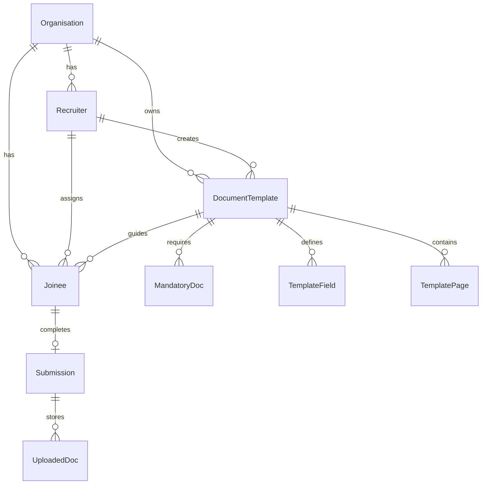

<div align="center">

# 🌈 FirstDay 😊

### A smoother first day for every new joinee ✨

[](https://github.com/Moleesh/FirstDay/actions/workflows/ci.yml)
[](https://github.com/Moleesh/FirstDay/actions/workflows/security.yml)
[](https://github.com/Moleesh/FirstDay/actions/workflows/deploy.yml)
[](https://nodejs.org/)
[](https://pnpm.io/)

**FirstDay** is a recruiter and joinee onboarding workspace for creating document
templates, collecting uploads, extracting fields with AI, capturing consent and
signatures, generating PDFs, and tracking progress with an audit trail. 😊

[Repository](https://github.com/Moleesh/FirstDay) ·
[CI Runs](https://github.com/Moleesh/FirstDay/actions/workflows/ci.yml) ·
[Security Scans](https://github.com/Moleesh/FirstDay/actions/workflows/security.yml) ·
[Issues](https://github.com/Moleesh/FirstDay/issues)

</div>

## 🎨 What FirstDay Does

| Experience    | Highlights                                                                                         |
| ------------- | -------------------------------------------------------------------------------------------------- |
| 🧑‍💼 Recruiters | Sign in, create reusable onboarding templates, assign joinees, and review progress.                |
| 😊 Joinees    | Upload required documents, review AI-assisted fields, sign, and download the completed PDF.        |
| 🔐 Operations | Use signed storage URLs, audit logs, CSRF protection, throttling, and server-side file validation. |
| ✨ Automation | Extract document details with Gemini and send status updates through Resend.                       |

## 🧭 Architecture



## 🛠️ Tech Stack

| Layer      | Stack                                                                            |
| ---------- | -------------------------------------------------------------------------------- |
| Monorepo   | Turborepo, pnpm workspaces                                                       |
| Web        | Next.js 14, React 18, Tailwind CSS, SCSS modules, Zustand, Jotai, TanStack Query |
| API        | NestJS 10, Fastify, Prisma, Passport, Swagger                                    |
| Data       | Supabase Postgres, Supabase Auth, Supabase Storage                               |
| Documents  | Gemini extraction, `pdf-lib`, React PDF, signature canvas                        |
| Quality    | Vitest, Playwright, ESLint, Prettier, pnpm audit, TruffleHog, Snyk               |
| Deployment | Railway API, Vercel web app                                                      |

## 📁 Monorepo Map

```text
apps/
├── api/       NestJS API, Prisma schema, and API tests
└── web/       Next.js app, components, and Playwright flows

packages/
├── config/    Shared tooling configuration
├── schemas/   Shared Zod schemas
├── types/     Shared TypeScript types
└── ui/        Shared UI components
```

## 🚀 Local Setup

### Prerequisites

- [Node.js 24](https://nodejs.org/) 😊
- [pnpm 9.15.4](https://pnpm.io/installation)
- A [Supabase](https://supabase.com/) project with Auth, Postgres, and Storage
- A [Gemini API key](https://aistudio.google.com/app/apikey)
- A [Resend API key](https://resend.com/api-keys)

### Start The App

```bash
pnpm install
cp .env.example .env
pnpm --filter @onboarding/api prisma:generate
pnpm --filter @onboarding/api prisma:migrate:deploy
pnpm dev
```

> On Windows PowerShell, use `Copy-Item .env.example .env` instead of `cp`.

Once the dev servers are running:

| Service             | URL                                                      |
| ------------------- | -------------------------------------------------------- |
| 🌈 Web app          | [http://localhost:3000](http://localhost:3000)           |
| ⚡ API              | [http://localhost:4000](http://localhost:4000)           |
| 📚 Swagger API docs | [http://localhost:4000/docs](http://localhost:4000/docs) |

## 🔑 Environment Variables

Create `.env` from [`.env.example`](./.env.example), then replace the sample
values with your own secrets. Never commit `.env`. 🔐

| Name                            | Used By | Description                                              |
| ------------------------------- | ------- | -------------------------------------------------------- |
| `DATABASE_URL`                  | API     | PostgreSQL connection string                             |
| `GEMINI_API_KEY`                | API     | Gemini key for AI-assisted extraction                    |
| `JOINEE_JWT_SECRET`             | API     | Joinee token secret, at least 32 characters              |
| `RESEND_API_KEY`                | API     | Resend key for notification emails                       |
| `SUPABASE_JWT_SECRET`           | API     | Supabase JWT verification secret, at least 32 characters |
| `SUPABASE_SERVICE_ROLE_KEY`     | API     | Server-only Supabase service role key                    |
| `SUPABASE_URL`                  | API     | Supabase project URL                                     |
| `WEB_ORIGIN`                    | API     | Allowed web origin for CORS                              |
| `NEXT_PUBLIC_API_URL`           | Web     | Browser-facing API URL                                   |
| `NEXT_PUBLIC_SUPABASE_ANON_KEY` | Web     | Browser-safe Supabase anonymous key                      |
| `NEXT_PUBLIC_SUPABASE_URL`      | Web     | Browser-facing Supabase project URL                      |

## 🧪 Useful Commands

| Command                                     | Purpose                                 |
| ------------------------------------------- | --------------------------------------- |
| `pnpm dev`                                  | Start every development server          |
| `pnpm build`                                | Build all apps and packages             |
| `pnpm lint`                                 | Run ESLint across the monorepo          |
| `pnpm format`                               | Check Prettier formatting               |
| `pnpm test`                                 | Run unit and component tests            |
| `pnpm typecheck`                            | Run TypeScript checks                   |
| `pnpm validate:env`                         | Validate required environment variables |
| `pnpm --filter @onboarding/web e2e`         | Run Playwright flows                    |
| `pnpm --filter @onboarding/api prisma:seed` | Seed local onboarding data              |

## 🗄️ Data Model



## ✅ CI, Security, And Deployments

| Workflow                                                                       | Trigger                              | What It Does                                                                                                  |
| ------------------------------------------------------------------------------ | ------------------------------------ | ------------------------------------------------------------------------------------------------------------- |
| [CI](https://github.com/Moleesh/FirstDay/actions/workflows/ci.yml)             | Pull requests and manual runs        | Environment validation, linting, formatting, tests, audit, secret scan, Prisma dry run, build, and Playwright |
| [Security](https://github.com/Moleesh/FirstDay/actions/workflows/security.yml) | Mondays at 03:00 UTC and manual runs | pnpm audit, Snyk, and TruffleHog                                                                              |
| [Deploy](https://github.com/Moleesh/FirstDay/actions/workflows/deploy.yml)     | Pushes to `main`                     | Tests, build, Prisma migrations, Railway API deploy, and Vercel web deploy                                    |
| [Migrate](https://github.com/Moleesh/FirstDay/actions/workflows/migrate.yml)   | Manual runs                          | Deploy Prisma migrations                                                                                      |

### 🌍 Live URLs

The deployment workflow targets Railway and Vercel, but the public production
URLs are not stored in this repository yet. Add them here once confirmed. 😊

| Service             | Production URL |
| ------------------- | -------------- |
| 🌈 Web app          | _To be added_  |
| ⚡ API              | _To be added_  |
| 📚 Swagger API docs | _To be added_  |

## 🛡️ Security Notes

- Keep `.env` local and store deployment secrets in GitHub Actions. 🔐
- Joinee and Supabase JWT secrets must contain at least 32 characters.
- The API includes Helmet, throttling, CSRF protection, signed URLs, audit logging,
  and server-side MIME validation.
- Development-only helpers must remain guarded by `NODE_ENV === "development"`.

## 🤝 Contributing

1. Create a branch using `feat/`, `fix/`, `chore/`, or `docs/`.
2. Make a focused change and add tests where needed. 😊
3. Run `pnpm lint`, `pnpm format`, `pnpm test`, and `pnpm build`.
4. Open a pull request and confirm that no secrets were committed.

## 🌟 Roadmap

- [ ] Bulk joinee import
- [ ] Aadhaar eSign via DigiLocker
- [ ] Multi-language support
- [ ] Mobile app with shared schemas

## 📄 License

No license file has been added yet. Until a license is chosen, this repository
should be treated as proprietary.

---

<div align="center">

Built to make onboarding feel a little lighter, clearer, and happier. 😊 🌈 ✨

</div>
